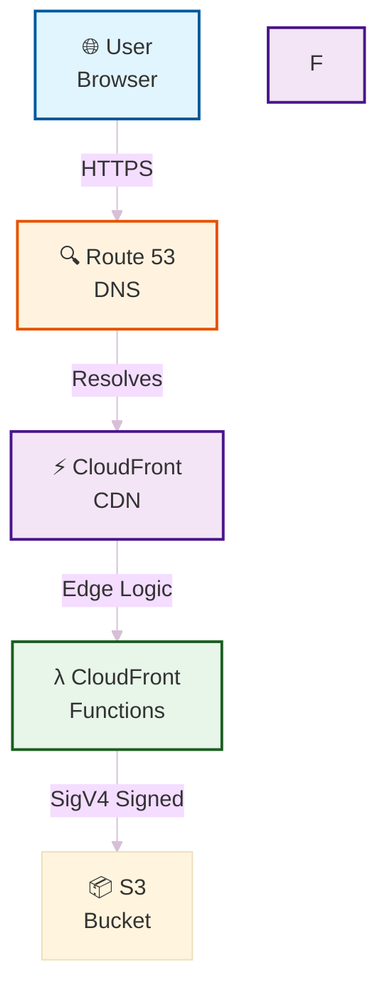

# bryan chasko · cloudcroft cloud company

```
+--------------------------------------------------+
|  bryan chasko · cloudcroft cloud company         |
|  bryanchasko.com                                 |
|  aws · ai/ml · hugo · cloudfront · woodpecker   |
+--------------------------------------------------+
```

---

## markdown style guide

See [MARKDOWN_GUIDE.md](MARKDOWN_GUIDE.md) for Markdown syntax, formatting, autoformatting, and linting instructions.

---

## agentic instructions

For focused agent instructions (CSS, setup, CI/CD, etc.), see [agentic_instructions/README.md](agentic_instructions/README.md) for the full menu and links to all fragments.

---

Development Command:
hugo server --config hugo.toml

Production Command:
hugo --minify --gc

Deploy: push to main — woodpecker pipeline at `.woodpecker/deploy.yml` builds with hugo, syncs to s3://bryanchasko.com, invalidates cloudfront E2E9BSL5RVN6DI. Auth via rolesanywhere → ci-deploy → ci-bryanchasko (no long-lived iam keys)

## architecture diagrams

### website architecture



## how to replicate this stack for your own site

This repository contains the Hugo site for bryanchasko.com. Below are concise, developer-focused instructions to get the site running locally, troubleshoot common issues, and contribute.

**Developer Quickstart**

- **Prerequisites**: Homebrew (macOS) and Git installed. Install Hugo via Homebrew: `brew install hugo`.
- **Clone repo**: `git clone <repo-url> && cd bryan-chasko-com`
- **Start dev server (recommended)**: `hugo server --config hugo.toml -D --themesDir ./themes`
- **Open**: `open http://localhost:1313`

**Configuration files**

- **Primary config**: This project uses `hugo.toml` at the repository root. Older docs mention `config.dev.toml` and `config.prod.toml`; these are optional aliases. Use `--config` to point to any custom config file.
- **If Hugo complains about "Unable to locate config file"**: make sure you run the server from the repository root (where `hugo.toml` lives), or pass `--config ./path/to/config` and `--source ./path/to/site`.

**Theme (custom: bryan-chasko-theme)**

- The site uses a fully custom theme at `themes/bryan-chasko-theme/`. PaperMod was retired 2026-04-26
- Theme is tracked in-tree (not a submodule). All layout + css + js lives under `themes/bryan-chasko-theme/`
- Design system documented at `/theme/` (live page) — see `themes/bryan-chasko-theme/assets/css/core/variables.css` for the source-of-truth tokens

**Run locally (examples)**

- Start server using root config:

```bash
hugo server --config hugo.toml -D --themesDir ./themes
```

- If you prefer a dev-specific config (copy `hugo.toml` to `config.dev.toml`):

```bash
cp hugo.toml config.dev.toml
hugo server --config config.dev.toml -D --themesDir ./themes
```

- If your Hugo site lives in a subdirectory, point `--source`:

```bash
hugo server --source ./site-subdir --config ./site-subdir/hugo.toml -D
```

**Build for production**

- Generate static files: `hugo --config hugo.toml` (outputs to `public/` by default).
- If you use `config.prod.toml`: `hugo --config config.prod.toml`.

**Deploy**

- Deployment to S3, CloudFront, and Route 53 is documented in `README_HOSTING.md`. Follow that guide for production deployment steps.

**Adding content**

- Create a new post: `hugo new blog/posts/my-new-post.md` and edit the file in `content/`.
- For index/home content, edit `content/_index.md`.

**Troubleshooting checklist**

- Hugo reports missing config: confirm current working dir contains `hugo.toml` or pass `--config`/`--source`.

## deployment & best practices

### deployment workflow

**ALWAYS follow this workflow to prevent broken code in production:**

```
Feature Branch → Test Locally → Pull Request → Human Review → Merge to main → Deploy
```

Deployment runs via woodpecker (`.woodpecker/deploy.yml`) on push to main:

- hugo --minify build
- aws s3 sync public/ s3://bryanchasko.com --delete
- cloudfront invalidation against E2E9BSL5RVN6DI

Auth chain: rolesanywhere trust anchor → ci-deploy → ci-bryanchasko (site-scoped). Zero long-lived iam keys.

### quick deploy

```bash
# ensure working on main and all tests pass
git status
npm test

# 2. Deploy to production (includes test gate)
perl scripts/deploy.pl --profile websites-bryanchasko --verbose

# 3. Verify site is live
curl -I https://bryanchasko.com/
```

## aws architecture

This site uses a modern, secure AWS architecture:

- **S3 Bucket** (`[your-site-domain]`) - Private bucket (Block Public Access enabled)
- **Origin Access Control** (`[YOUR-OAC-ID]`) - SigV4-signed CloudFront access
- **CloudFront Distribution** (`[YOUR-DISTRIBUTION-ID]`) - Global CDN for fast delivery
- **Route 53** - DNS routing to CloudFront
- **ACM Certificate** - Free SSL/TLS with auto-renewal

**Why this setup?**

- ✅ No public S3 URLs (private bucket)
- ✅ CloudFront caches content globally (fast)
- ✅ OAC signs requests securely (SigV4)
- ✅ Only ~$1.50/month cost (S3 + CloudFront + DNS)

See [**AWS_ARCHITECTURE.md**](AWS_ARCHITECTURE.md) for complete architecture documentation.

## security & secrets management

**Never commit AWS credentials or account-specific data to GitHub.**

### what's gitignored (account-specific)

- `_README_HOSTING.md` - Deployment instructions
- `_AWS_ENVIRONMENT_DETAILS.md` - Account details
- `bucket-policy.json`, `cloudfront-config.json` - Infrastructure configs
- All `*-config.json` files

### configuration

Use `~/.bcc-site/config.json` for your AWS settings (not in GitHub):

```json
{
  "SITE_DOMAIN": "[your-site-domain]",
  /* Lines 701-704 omitted */
  "AWS_REGION": "us-west-2"
}
```

**Never hardcode ARNs, bucket names, or distribution IDs in public code.**

**For Complete CI/CD Setup Details**: See [CI_CD_SETUP.md](CI_CD_SETUP.md)

**Contributing**

- Fork → Branch → PR. Keep changes focused: templates, CSS in `assets/` or `layouts/`, and content in `content/`.
- Run the site locally to verify changes: `hugo server --config hugo.toml -D`.
- **IMPORTANT**: Don't push to main without:
  /_ Lines 717-745 omitted _/

thank you — happy hacking
